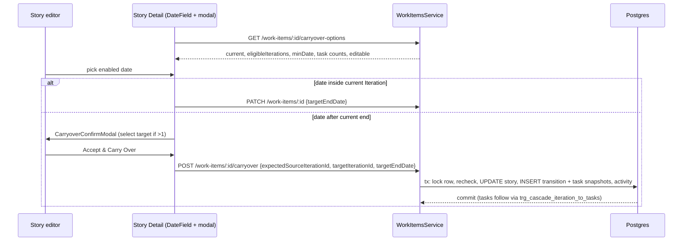

# Phase 7 — Story Date Tracking and Carryover (`CO`, US-109…US-118): implementation plan

| Attribute | Value |
|---|---|
| Status | Plan approved 2026-10-02. Tasks 0–12.3 done 2026-10-05 (evidence under each task); 12.4–12.5 (push, PR, CI) pending user go-ahead. |
| Author | Solution Architect |
| Created | 2026-10-02 |
| Feature code | `CO` (FE-37), delivery stories US-109…US-118 (CO-01…CO-10) |
| Sources of truth | `Mini_Rally_pj/04_Developement_tracking/Phase 7 (After MVP)/Story Date and Carryover/{FEATURE,SRS,USER_STORIES}.md`; mockup `Mini_Rally_pj/03_Mockup Design/src/app/{App.tsx,model.ts,pages/WorkItemDetailPage.tsx,pages/IterationStatusPage.tsx,pages/ReportsPage.tsx}` (commit ad4bc4deaafa6f4d3011ed1f294ac574696f707d) |
| Precedent | `docs/PLAN-phase7-split-unfinished.md` (transaction shape, event tables, attribution window, gate) |
| Delivery rule | **ONE PR covering all 10 User Stories** (user ruling; overrides the Split "1 US = 1 PR" precedent). Commits may be per-task for reviewability. |
| Precedence | SRS + ACs override the mockup where they differ (mockup ignores Iteration state, multiple targets, and bounds Actual After). |

> **How to use this file.** Every task is a checkbox. Tick it only when the work is done AND its
> verification is green, and annotate the tick with what you verified (the `PLAN-phase7-test-cases.md`
> convention). A tick with no evidence is worse than no tick — the next session will trust it.
> Stick strictly to this plan: do not add or remove scope. Anything ambiguous during execution is
> asked of the product owner, never guessed.

---

## Problem statement

Rova only knows a Story's current Iteration. It does not record when work actually starts/ends,
cannot forecast completion, and has no auditable same-ID movement to a later Iteration — so Task
Actual hours either vanish from the source or are double-counted.

## Requirements

BA: CO-BR-01…46, SRS AC1–AC27, CO-01…CO-10 ACs, Feature DoD (server-side authz, no partial movement
or duplicate event on retry, automated tests for lifecycle stamping, picker boundaries, overlapping
targets, cancel, atomic failure, repeated Carryover, report formulas).

---

## 0. Product-owner rulings (binding)

| # | Ruling |
|---|---|
| R1 | **CSV export for ALL FOUR reports** (Iteration Burndown, Velocity, Team Capacity, Carryover). Requires a NEW permission `report:export` + backfill migration. Deviates from CO-BR-03 → declared divergence in `CLAUDE.md`. |
| R2 | New columns `start_date`/`actual_end_date`. Story Actual End Date stamped ONLY on first entry into `accepted` (entering `release` directly leaves it blank). Do NOT reuse `accepted_date` (it is the current outcome; `trg_sync_accepted_date` clears it on reopen). |
| R3 | Literal SRS: only Carryover snapshots bound Actual intervals. Manual Move captures NO task snapshot and is NOT an attribution boundary. Known limitation: Actual logged after a manual return is not attributed to the returned Iteration — record as declared limitation. |
| R4 | `report:export` granted to Workspace Admin + full Project Admin. NOT Read-only Project Admin, NOT Editor/Project Member. |
| R5 | Backfill lifecycle dates from `activity_logs` (first logged transition into `in_progress` / `accepted` for Stories, `in_progress` / `completed` for Tasks), as a workspace-local date. Rows without a log stay NULL — never guessed. |
| R6 | Unscheduled Story → Target End picker disabled. Current Iteration `accepted` → only eligible FUTURE Iterations' dates enabled; selecting one opens Carryover from the Accepted source. |
| R7 | **Strict team equality** between Story team and Iteration team (null matches only null). Do NOT reuse Split's Q2 shared-sprint rule. |
| R8 | Every user-initiated Story Iteration change records a Manual Move: `updateWorkItem` + `bulkAssignIteration`, Stories only, moves to/from Unscheduled included. Split's `[Continued]` move and timebox-delete unscheduling are NOT Manual Moves. |
| R9 | "Future" = mockup rule. Picker enables dates in the current Iteration (if eligible) plus any eligible Iteration with `startDate > current.startDate`. Carryover targets = those eligible Iterations containing the selected date, where the date is `> current.endDate`. Overlapping sprints may be targets; picker and target list always agree. |
| R10 | No additional research required. |
| R11 | Carryover Rate denominator excludes Split placeholders (`split_id IS NOT NULL`). |
| R12 | Revision History entries are written on the STORY only (no per-Task entries). |
| R13 | PR description AND squash-commit body must end with this block exactly: |

```
## Rova
[US-109: Record Story lifecycle dates](https://rova.qnsc.vn/item/US-109)
[US-110: Record Task lifecycle dates](https://rova.qnsc.vn/item/US-110)
[US-111: Select and validate Story Target End Date](https://rova.qnsc.vn/item/US-111)
[US-112: Review Carryover and resolve its target Iteration](https://rova.qnsc.vn/item/US-112)
[US-113: Commit same-ID Carryover atomically](https://rova.qnsc.vn/item/US-113)
[US-114: Recover through manual Iteration move and Target End clearing](https://rova.qnsc.vn/item/US-114)
[US-115: Trace Carryover in Revision History](https://rova.qnsc.vn/item/US-115)
[US-116: Show compact Carryover context in Iteration Burndown](https://rova.qnsc.vn/item/US-116)
[US-117: Attribute Carryover effort in Team Capacity](https://rova.qnsc.vn/item/US-117)
[US-118: Review the dedicated Carryover report](https://rova.qnsc.vn/item/US-118)
```

### Declared divergences / limitations (record in `CLAUDE.md`, not `docs/DIVERGENCE.md`)

1. `report:export` is a NEW permission, contrary to CO-BR-03 "no new permission" (R1/R4).
2. Manual Move is not an Actual attribution boundary (R3) — hours logged after a manual return are
   not attributed to the returned Iteration.
3. Retroactive Actual edits for work done before a Carryover are attributed to the later Iteration —
   `tasks.actual_hours` has no time series (same limitation as Split §8 Q1c).
4. Carryover suppresses `autoAcceptIterationIfComplete` for the source (Split Q9 precedent).
5. Lifecycle dates and Target End Date are Story-only (Defects get none) (D12).
6. Carryover uses strict team equality, which differs from Split's shared-sprint rule (R7).

---

## 1. Background (verified in code)

- `db/schema/work.ts`: `work_items` has `schedule_state` (`idea|defined|in_progress|completed|accepted|release`), `accepted_date` (current outcome only, 0087 trigger), `split_id`; `tasks` has `state` (`defined|in_progress|completed`), `iteration_id` mirror, `estimate_hours/todo_hours/actual_hours`; `iterations` has `team_id` (nullable), `state` (`planning|committed|accepted`), `start_date/end_date` (date). Latest migration is `0131_story_splits.sql` → next is 0132 (re-check at start).
- `0087_phase6_accepted_date.sql`: backfill-from-activity_logs THEN trigger — the pattern to copy. Activity action for state is `work_item.schedule_state_changed` with `changes = {field, old, new}`; task diff uses `task.state_changed` (`activity-diff.ts`). Verify the exact `new` values stored before writing the backfill CTEs.
- `0095_task_iteration_derived.sql`: `trg_task_iteration_from_parent` + `trg_cascade_iteration_to_tasks` → Tasks follow the Story automatically (CO-BR-23 by construction). Never write `tasks.iteration_id` (TASK_ITERATION_DERIVED).
- 0074: Story hours are derived from tasks — no rollup columns to write.
- `work-items.service.ts`: `splitWorkItem` (requireReadable → assertProjectWritable → eligibility → expectedSourceIterationId echo → `uow.run` with `lockRow` + echo recheck), `updateWorkItem` (diffWorkItem → appendMany activity in tx; autoAcceptIterationIfComplete on iteration change), `bulkAssignIteration`, `findWorkspaceTimeZone` + `workspaceLocalDate`, `assertIterationAssignable`, `teamScopeFor`, `listTasksByParent`.
- `libs/modules/work-items/src/domain/iteration-assignable.ts` exists (Split) — do NOT use its shared-sprint rule for Carryover (R7); Carryover gets its own strict predicate.
- `reporting`: `team-capacity.ts` `attributeActualHours({actualHours, actualAtArrival, actualAtDeparture})` = `max(0, upper − lower)`; repository `getScopedTaskHours` = `residentTaskRows` + `departedTaskRows`, bounds from `splitBound(...)` over `story_split_items` continued-side rows. Controller routes `GET /reports/{iteration-burndown,velocity,team-capacity,release-tracking,...}` gated `@RequirePermission('report:view', { from: 'query', field: 'projectId' })`.
- `db/permissions.catalog.ts`: `REPORT_VIEW` held by WORKSPACE_ADMIN and PROJECT_ADMIN only; a "Read-only" Project Admin access level exists (see `CLAUDE.md` access-model + declared-divergences sections ~920-955 for how access levels map and how new codes are backfilled). No export exists anywhere in Rova (Phase 6 contract lists export format out of scope).
- FE: `shared/ui/date-field.tsx` + `shared/ui/calendar.tsx` (need additive `isDateDisabled`), `AppModal`/`ModalBody`/`ModalFooter`, shared `Button`/`IconButton`, `CompactSelect`, `SearchableSelect`, `EmptyState`, `PageHeader`, `entities/activity/ui/activity-history-tab.tsx` + `entities/work-item/model/activity.ts` `describeActivity`, `pages/reports/reports-page.tsx` (`REPORT_TYPES = ['burndown','velocity','capacity']`, persisted in localStorage), `pages/reports/model/use-selected-iteration.ts`, `pages/work-item/ui/{detail-sidebar,tasks-tab}.tsx`, `pages/iteration-status/model/{columns,filter-fields}.ts`, `useProjectPermissions` + `PERMISSION` config.
- Hard FE constraints (ratchets): AppModal only (no `fixed inset-0` div), shared Button (`MAX_RAW_BUTTON` frozen), zero raw hex (tokens only), every string via `t()`, files ≤500-line soft cap, no `const { data = [] } = useX()` additions beyond `MAX_QUERY_DEFAULTS`, FSD layering.
- Backend ratchets: route-policy (every route decorated), route-audience (project-tier overload `{resource, from, field}` for project codes), workspace-scope, query-ordering 0 (every list query ordered), coverage floors (raise never lower), `coverage.include` for new spec subjects. Response dates are `z.string()` (date) / `z.string().datetime()` (timestamp), never `z.date()`. New error codes must be added to `libs/platform/src/errors/error-codes.ts`.
- Codegen: restart API, `pnpm --filter rova-web codegen`, grep served spec, CI `codegen:check`.
- PR rules (CONTRIBUTING.md): Conventional Commits title, lowercase subject, scope required for `feat`, squash-only; never push to main; `gh pr create`; stage specific files only.

---

## 2. Design decisions (DEV)

| # | Decision |
|---|---|
| D1 | No new backend module. Carryover write path lives in `work-items`; read/report/export in `reporting`. |
| D2 | **Migration `0132_story_lifecycle_dates.sql`**: `work_items.start_date date`, `work_items.actual_end_date date`, `work_items.target_end_date date`, `tasks.start_date date`, `tasks.actual_end_date date`. Order: ADD COLUMNs → backfill (R5) → create triggers. `work.stamp_story_lifecycle_dates()` BEFORE INSERT OR UPDATE ON work_items, acts only when `NEW.type = 'story'`: if `NEW.schedule_state='in_progress'` and start_date null → workspace-local today; if `NEW.schedule_state='accepted'` and actual_end_date null → workspace-local today (R2: `release` does not stamp); on UPDATE, if OLD value not null, force NEW := OLD (never overwritten/cleared). `work.stamp_task_lifecycle_dates()` same for tasks (`in_progress` → start_date, `completed` → actual_end_date). Workspace-local date = `(now() AT TIME ZONE coalesce(<workspace_settings.timezone for NEW.workspace_id>, 'UTC'))::date`. The two lifecycle columns are in NO Create*/Update* zod schema. Mirror into `db/schema/work.ts` in the same commit. Hand-written migration (drizzle-kit generate needs a TTY). |
| D3 | **Migration `0133_iteration_transitions.sql`**: enum `iteration_transition_type ('carryover','manual_move')`. `work.iteration_transitions` (id uuid pk uuidv7, workspace_id, project_id, team_id null = Story team at move, story_id → work_items, type, source_iteration_id null → iterations, target_iteration_id null → iterations, target_end_date date null, actor_id null, occurred_at timestamptz default now, created_at). CHECK: `type='carryover'` ⇒ source, target and target_end_date NOT NULL. `work.iteration_transition_tasks` (id, workspace_id, transition_id → iteration_transitions ON DELETE CASCADE, task_id → tasks, state task_state, estimate_hours_at_move, todo_hours_at_move, actual_hours_at_move numeric(8,2)) — rows written for Carryover only (R3). Indexes: `(story_id, occurred_at)`, `(source_iteration_id, occurred_at)`, `(target_iteration_id, occurred_at)`, `ix_itt_task (task_id)` (load-bearing Capacity join), `(transition_id)`. Immutability trigger raising on UPDATE/DELETE of both tables (CO-BR-46). Mirror in schema/enums. |
| D4 | **Migration `0134_report_export_permission.sql`** + `db/permissions.catalog.ts`: `REPORT_EXPORT: 'report:export'`, tier `project`, granted to WORKSPACE_ADMIN and PROJECT_ADMIN and to the full-admin project access level, NOT Read-only Project Admin, NOT PROJECT_MEMBER/Editor (R4). Backfill grants to existing role rows per the repo's new-permission rule (read `CLAUDE.md` access-model section and `0130_test_case_permissions.sql` precedent first). |
| D5 | One pure module `libs/modules/work-items/src/application/carryover-eligibility.ts` (unit-tested without DB): `isEligibleIteration(story, iteration, current)` = same project ∧ strict team equality (R7) ∧ state ∈ {planning, committed} ∧ (iteration is current ∨ iteration.startDate > current.startDate) (R9); `eligibleIterations(...)` sorted by startDate then name; `minDate(story, eligible)` = story.startDate if set, else start of earliest eligible Iteration (CO-BR-13/14); `isEnabledDate(date, ...)` = date ≥ minDate ∧ inside some eligible Iteration; `resolveTargets(date, current, eligible)` = eligible Iterations ≠ current containing date, only when date > current.endDate. Dates compared as ISO strings. Used by options endpoint, PATCH validation and POST. The SPA never decides eligibility itself — it consumes the server's options payload (it may mirror the date predicate from that payload for disabling days). |
| D6 | **`POST /work-items/:id/carryover`** `@RequirePermission('work_item:edit', { resource: 'work_item', from: 'param', field: 'id' })`. Body `{ expectedSourceIterationId: uuid, targetIterationId: uuid, targetEndDate: YYYY-MM-DD }`. Order: requireReadable (Editor team boundary) → assertProjectWritable → type must be story (`CARRYOVER_NOT_ELIGIBLE`) → story.iterationId must equal expectedSourceIterationId (`CARRYOVER_SOURCE_ITERATION_CHANGED`) → eligibility via D5 (date enabled, date > current.end, target ∈ resolveTargets) else `CARRYOVER_TARGET_INVALID`. Then `uow.run(tx)`: `lockRow` + recheck echo (412 `CARRYOVER_SOURCE_ITERATION_CHANGED` — this makes retries/concurrent confirms produce no duplicate event) → read live Tasks → UPDATE story `iteration_id`, `target_end_date`, `updated_by` → INSERT transition (carryover) + one snapshot row per live Task (state, estimate, todo, cumulative actual) → append ONE activity `work_item.carried_over` (changes `{field:'iterationId', old, new}`, metadata `{transitionId, sourceIterationId, sourceIterationName, targetIterationId, targetIterationName, targetEndDate}`). Do NOT call `autoAcceptIterationIfComplete` for the source (Split Q9 precedent — Carryover must not silently close the source). No reconcileParentScheduleState (state unchanged). Response 201 `{ transition: IterationTransitionDto, workItem: WorkItemResponseDto }`. |
| D7 | **Target End via `PATCH /work-items/:id`** (`targetEndDate` added to UpdateWorkItemSchema, nullable date): non-story → 412 `TARGET_END_NOT_SUPPORTED`; `null` → clear (always allowed to an editor; Iteration/history untouched, CO-BR-28); date not enabled by D5 → 412 `TARGET_END_DATE_INVALID`; date > current.endDate → 412 `TARGET_END_REQUIRES_CARRYOVER` (server never moves without confirmation); else save. Unscheduled story: only `null` allowed (R6). Diff action `work_item.target_end_date_changed`. |
| D8 | **`GET /work-items/:id/carryover-options`** `@RequirePermission('work_item:view', { resource: 'work_item', from: 'param', field: 'id' })` → `{ editable: boolean, storyStartDate, targetEndDate, current: {id,name,iterationKey,state,startDate,endDate,eligible} \| null, minDate \| null, eligibleIterations: [{id,name,iterationKey,state,startDate,endDate,teamId}], taskCount, unfinishedTaskCount }`. `editable` = caller can edit AND story is scheduled AND eligibleIterations non-empty. `startDate/endDate` are `z.string()` not `.datetime()`. Field naming mirrors entity columns (`name` for iterations, `title` for work items). |
| D9 | **Manual Move** (R8): in `updateWorkItem` and `bulkAssignIteration`, when a STORY's `iterationId` changes, inside the same tx insert one `manual_move` transition (no task snapshot rows, R3; target_end_date null) and log activity `work_item.iteration_moved` (metadata `{transitionId, sourceIterationId, sourceIterationName, targetIterationId, targetIterationName}`) — replacing the generic `work_item.updated` entry for the `iterationId` field on Stories only (Defects keep current behaviour). Existing autoAccept behaviour for manual moves is unchanged. Never creates/deletes a Carryover row. |
| D10 | **Attribution** (CO-BR-31..33, R3): generalise the repository's `splitBound` into a boundary union of Split continued-side rows (`story_split_items`) and Carryover snapshot rows (`iteration_transition_tasks` joined to `iteration_transitions` type='carryover'), ordered by event time; arrival = latest boundary INTO the reported iteration(s), departure = earliest boundary OUT. `departedTaskRows` admits Carryover departures too (contributing Actual only; Estimate/To Do = 0 — they follow the Task). Keep `attributeActualHours` unchanged (clamp at 0). Preserve the existing "both ends inside iterationIds bounds nothing" rule for both event kinds. Split behaviour must not change (existing Split specs stay green). Report rows: Actual Before = Σ this event's actual snapshot; Actual After = Σ per Task max(0, (next Carryover snapshot of same Task after this event, else current actual) − this snapshot). Known limitation (record): retroactive Actual edits for pre-move work are attributed to the later Iteration; manual returns are not boundaries (R3). |
| D11 | **Export** (R1/R4): `GET /reports/iteration-burndown/export`, `/reports/velocity/export`, `/reports/team-capacity/export`, `/reports/carryover/export`, each `@RequirePermission('report:export', { from: 'query', field: 'projectId' })`, same query DTO as its report, calls the SAME service method as the JSON report, serialises via shared `libs/modules/reporting/src/application/report-csv.ts` (RFC 4180 escaping, CRLF, UTF-8 BOM optional per existing conventions if any, formula-injection guard prefixing `'` to cells beginning with `= + - @ \t \r`), returns `text/csv; charset=utf-8` with `Content-Disposition: attachment; filename="<report>-<projectKey>-<iteration/window>.csv"`. Carryover export honours Iteration + Direction filters (rows filtered exactly like the screen). SPA Export button shown only when the user holds `report:export` (via `useProjectPermissions`), download via the BFF as a blob. |
| D12 | Lifecycle dates/Target End are Story-only; Defects get none (CO-BR-01, SRS §5.3). |
| D13 | Fixtures: strict team equality (R7) leaves seeded data with few valid targets — BE e2e and Playwright specs create their own team-scoped future Iterations via the API in setup. Do NOT change shared seeds (keeps the `e2e-fixtures` ratchet unchanged). |

### 2.1 Carryover flow



---

## 3. Data model

| Migration | Adds | Decision |
|---|---|---|
| `0132_story_lifecycle_dates.sql` | `work_items.{start_date, actual_end_date, target_end_date}`, `tasks.{start_date, actual_end_date}`; backfill from `activity_logs`; `work.stamp_story_lifecycle_dates()` + `work.stamp_task_lifecycle_dates()` BEFORE triggers | D2, R2, R5 |
| `0133_iteration_transitions.sql` | enum `iteration_transition_type`; `work.iteration_transitions`; `work.iteration_transition_tasks`; immutability trigger | D3, R3 |
| `0134_report_export_permission.sql` | `report:export` grants + backfill | D4, R1, R4 |

Numbers re-checked against `origin/main` at Task 0; renumber if main moved. Each migration is mirrored
into `db/schema/work.ts` / `db/schema/enums.ts` in the same commit.

## 4. API surface

| Route | Permission | Decision |
|---|---|---|
| `GET /work-items/:id/carryover-options` | `work_item:view` (project-tier, `param id`) | D8 |
| `PATCH /work-items/:id` (+ `targetEndDate`) | existing `work_item:edit` | D7 |
| `POST /work-items/:id/carryover` | `work_item:edit` (project-tier, `param id`) | D6 |
| `GET /reports/carryover` | `report:view` (`query projectId`) | Task 10 |
| `GET /reports/{iteration-burndown,velocity,team-capacity,carryover}/export` | `report:export` (`query projectId`) | D11 |

Additive response fields: work-item + task `startDate`, `actualEndDate`; work-item `targetEndDate`;
burndown + team-capacity `carryover: CarryoverSummaryDto | null`.
New error codes: `TARGET_END_NOT_SUPPORTED`, `TARGET_END_DATE_INVALID`, `TARGET_END_REQUIRES_CARRYOVER`,
`CARRYOVER_NOT_ELIGIBLE`, `CARRYOVER_TARGET_INVALID`, `CARRYOVER_SOURCE_ITERATION_CHANGED`.
New activity actions: `work_item.target_end_date_changed`, `work_item.carried_over`, `work_item.iteration_moved`.

---

## 5. BR → enforcement → test matrix

"auto" = satisfied by existing machinery; needs a regression test, not new code.

| BR | Rule (short) | Where enforced | Test |
|---|---|---|---|
| 01 | Only a Story supports Target End / Carryover | D5/D6/D7 type check, D12 | unit + BE e2e (Defect 412) |
| 02 | Must already be able to edit the Story | `PolicyGuard` `work_item:edit` + `requireReadable` | BE e2e authz |
| 03 | No new role/permission | **diverged for `report:export` (R1)** | route-policy / route-audience ratchets |
| 04 | Target same Project + Team | D5 strict equality (R7) | unit (null/null, null/team, team/team) |
| 05 | Target later, `planning`/`committed` | D5 (R9) | unit + BE e2e |
| 06 | Story Start Date on first `in_progress` | 0132 trigger | BE e2e |
| 07 | Story Actual End on first `accepted` | 0132 trigger (R2) | BE e2e (incl. direct `release` blank) |
| 08 | Task Start Date on first `in_progress` | 0132 trigger | BE e2e |
| 09 | Task Actual End on first `completed` | 0132 trigger | BE e2e |
| 10 | Lifecycle dates read-only, never recalculated/cleared | trigger keeps OLD; not in any request DTO | BE e2e (reopen, iteration change, explicit write) |
| 11 | Carryover preserves lifecycle dates | D6 writes no lifecycle column | BE e2e |
| 12 | Target End user-managed, clearable | D7 | BE e2e + FE unit |
| 13 | Not earlier than Start Date | D5 `minDate` | unit + BE e2e |
| 14 | No Start Date → earliest eligible Iteration start | D5 `minDate` | unit |
| 15 | Only eligible current/future Iteration dates enabled | D5 `isEnabledDate` | unit + FE unit |
| 16 | Out-of-window date disabled, cannot initiate Carryover | D5 + D7 `TARGET_END_DATE_INVALID` | unit + FE unit + BE e2e |
| 17 | Inside current → save, no move | D7 | BE e2e + FE unit |
| 18 | After current → confirmation, nothing persisted | D7 `TARGET_END_REQUIRES_CARRYOVER` + Task 4 modal | BE e2e + FE unit |
| 19 | One eligible target → proposed | D5 `resolveTargets` + modal | FE unit |
| 20 | Multiple targets → must select | modal | FE unit + Playwright |
| 21 | Summary: ranges, Story ID, total + unfinished Tasks | D8 payload + modal | FE unit |
| 22 | Accept moves same ID + saves Target End | D6 | BE e2e |
| 23 | Tasks follow the Story | **auto** (0095 triggers) | BE e2e regression |
| 24 | Everything else unchanged | D6 writes only `iteration_id`, `target_end_date`, `updated_by` | BE e2e (column-by-column) |
| 25 | Cancel / close / Escape / failure change nothing | modal is local; D6 one tx | FE unit + BE e2e |
| 26 | Manual Iteration editing remains | existing `updateWorkItem` | BE e2e |
| 27 | Manual change → Manual Move, no Carryover change | D9 | BE e2e |
| 28 | Clearing Target End does not move / delete history | D7 | BE e2e |
| 29 | Estimate / To Do / Actual independent | **auto** (no derivation in D6) | BE e2e regression |
| 30 | Snapshot: ids, timestamp, Target End, per-Task values | D6 + D3 | BE e2e |
| 31 | Source Actual bounded at outbound Carryover | D10 | unit + BE e2e |
| 32 | Target Actual starts at zero | D10 | BE e2e |
| 33 | Repeated Carryovers: no double count | D10 window | BE e2e (3/4/3) |
| 34 | Compact badge on Burndown + Capacity, opens report | Tasks 8/9 | BE e2e + FE unit + Playwright |
| 35 | Report contains only Carryover events | report domain | BE e2e |
| 36 | Carry In / Carry Out counts | `domain/carryover.ts` | unit |
| 37 | Transferred To Do; Direction does not change KPI | `domain/carryover.ts` | unit + FE unit |
| 38 | Carryover Rate | report domain (R11) | unit |
| 39 | Trend per Iteration in scope | report domain | unit + BE e2e |
| 40 | Row columns incl. Actual Before / After | report domain (D10) | unit + FE unit |
| 41 | Direction filter All / In / Out on rows only | report domain + FE | unit + FE unit |
| 42 | Export uses permission + active filters | D11 (R1/R4) | BE e2e authz + CSV parity |
| 43 | One accepted Carryover = exactly one event | D6 lock + echo recheck | BE e2e (concurrent + retry) |
| 44 | History: actor, time, source, target, Target End | D6 activity + Task 7 | FE unit + BE e2e |
| 45 | Stable ids for attribution; names display-only | D3 FKs; names only in activity metadata | BE e2e |
| 46 | Events immutable | D3 trigger | BE e2e (UPDATE/DELETE refused) |

---

## 6. Delivery — one PR, tasks in order (TDD, each task demoable, no orphan code)

### Task 0 — Plan file and branch

- [x] 0.1 Write this plan to `docs/PLAN-phase7-story-carryover.md` (FIRST ACTION). **DONE 2026-10-02** — file written; sections §0–§6 and D1–D13 verified present by reading the file back.
- [x] 0.2 `git fetch origin`; branch `feat/story-date-tracking-carryover` from `origin/main`. **DONE** — `git fetch origin` exit 0; `git switch -c feat/story-date-tracking-carryover origin/main`; `git status` clean apart from this file.
- [x] 0.3 Confirm next free migration number (renumber 0132–0134 if main moved). **DONE** — `git ls-tree origin/main db/migrations/` ends at `0131_story_splits.sql`; 0132–0134 stand.
- Demo: plan file in `docs/`.

### Task 1 — Persist lifecycle dates (CO-01/CO-02 data)

- [x] 1.1 Tests first (BE e2e): first In-Progress stamps workspace-local date; later state change / reopen / iteration change keeps it; accepted→reopen→accepted keeps first Actual End; direct `release` leaves blank (R2); Defect not stamped; task in_progress/completed stamps; backfill = earliest transition, rows without logs stay NULL; workspace time zone honoured; explicit write attempt cannot overwrite an existing value.
      **DONE 2026-10-02** — `test/e2e/story-lifecycle-dates.e2e.spec.ts`, **11/11 green** against `rally_dev` (`vitest run --config test/vitest.e2e.config.ts …`). Covers every case listed plus "an edit to an already-In-Progress undated row is NOT stamped". Fixtures keyed `LD-…`, removed in `afterAll`; workspace time zone restored.
- [x] 1.2 Migration 0132 part A (D2): columns (incl. `target_end_date`, unused until Task 3), backfill CTEs (R5), triggers.
      **DONE** — `db/migrations/0132_story_lifecycle_dates.sql` + `_journal.json` idx 133; `pnpm db:migrate` applied it (5 columns + 2 triggers confirmed in `information_schema` / `pg_trigger`).
      Two implementation refinements of D2, neither a scope change: (a) a date is stamped only on a TRANSITION into the state (INSERT, or `OLD.state IS DISTINCT FROM` the state) — "state is X and date is NULL" would give a pre-migration undated row TODAY's date on its next unrelated edit, which R5 forbids; (b) the backfill is a function `work.backfill_lifecycle_dates()` that the migration calls once, so the e2e exercises the same code (it only fills NULLs). Helper `work.workspace_local_date(workspace, at)`.
      Verified fact for later tasks: `task_state` lives in the **`work`** schema; the work-item enums live in `public`.
      Side effect to note in the PR: Split's `[Unfinished]` placeholder is INSERTed as `accepted`, so it now receives an Actual End Date of the Split day (first entry into Accepted, by the rule).
- [x] 1.3 Schema mirror in `db/schema/work.ts`. **DONE** — `startDate`/`actualEndDate`/`targetEndDate` on `workItems`, `startDate`/`actualEndDate` on `tasks`. (Typecheck runs with Task 2's DTO change.)
- Demo: migrate, change a seeded Story/Task state, row shows stamped date.

### Task 2 — Display lifecycle dates (CO-01/CO-02 complete)

- [x] 2.1 DTOs: `startDate`, `actualEndDate` (nullable `z.string()` date) on work-item + task responses (incl. Iteration Status feed and task list feed). Codegen.
      **DONE 2026-10-02** — `WorkItem` domain type + `WorkItemResponseSchema` (+ `targetEndDate`, populated from Task 3); both task row mappers and the `listTasksByParent` projection; `IterationStatusItem` + DTO carry `startDate`/`targetEndDate` with server-side text filters `startDate`/`targetEndDate` (substring of `YYYY-MM-DD`). Codegen against the restarted API: `api.ts` +28 lines, additive only. Backend e2e "read surfaces" case in `story-lifecycle-dates.e2e.spec.ts` (record = Task list = Iteration Status, filter is a real predicate) green — file **12/12**.
- [x] 2.2 FE: Story Detail read-only `DateField` Start Date + Actual End Date (placeholder "Not set" via i18n), Story only.
      **DONE** — new `pages/work-item/ui/story-date-fields.tsx` (`StartDateField` / `ActualEndDateField`, shared `DateField` read-only inside `ReadOnlyFieldValue`); placed under Iteration for a Story. i18n `sidebar.startDate` / `actualEndDate` / `notSet`.
- [x] 2.3 FE: Iteration Status `Start Date` column (read-only, filterable, story rows only).
      **DONE** — `columns.ts` (column + header), `StoryDateCell` in `status-cells.tsx` (keeps `status-row.tsx` at one line per column — it sits near the 929-line ceiling), empty cell on Task rows, Manage Filters text field `startDate`, `IterationStatusFilters` FE type.
- [x] 2.4 FE: Tasks tab columns + Task Detail fields Start Date / Actual End Date. Extract `pages/work-item/ui/story-date-fields.tsx` if `detail-sidebar.tsx` would exceed 500 lines.
      **DONE** — `detail-sidebar.tsx` was already 707 lines, so the fields live in `story-date-fields.tsx`; Task Detail shows them between Team and Work Product (mockup order). Tasks tab gains `startDate` / `actualEndDate` columns via the shared read-only `DateField`.
- [x] 2.5 Tests: DTO e2e; FE unit — "Not set" before event; Task list and Task Detail show identical values (CO-02 AC5).
      **DONE** — `detail-sidebar.test.tsx` +4 (Story Not set / stamped read-only / Task / Defect none) **18/18**; `tasks-tab.test.tsx` +2; `status-row.test.tsx` +3; `src/pages/work-item` + `src/pages/iteration-status` + `src/test` ratchets: **128/128**, FE ratchets 40/40. `pnpm build:web` exit 0; `pnpm lint` + `pnpm --filter rova-web lint` exit 0; `pnpm typecheck` exit 0; backend `libs/modules/{work-items,iterations}` + route-policy/workspace-scope/query-ordering/e2e-fixtures ratchets **430/430**.
- Demo: move a Task to In-Progress → Completed; dates appear on list and detail.

### Task 3 — Target End Date selection and validation (CO-03)

- [x] 3.1 `carryover-eligibility.ts` (D5) + unit tests (one predicate per test: each team case incl. null/null and null/team, each state, R9 start rule, minDate with/without Start Date, accepted current, unscheduled).
- [x] 3.2 `GET /work-items/:id/carryover-options` (D8).
- [x] 3.3 `targetEndDate` in Update schema + D7 validation; new error codes; activity `work_item.target_end_date_changed`; `targetEndDate` on responses. Codegen.
- [x] 3.4 FE: additive `isDateDisabled?: (iso: string) => boolean` on `Calendar` and pass-through on `DateField` (disabled days: `disabled` + `aria-disabled`, token styling, no raw hex).
- [x] 3.5 FE: `useCarryoverOptions` hook in `features/work-items/api.ts`; Target End Date field on Story Detail using `DateField` with Clear; picker disabled when `!editable` (read-only users, Unscheduled, no eligible Iterations — R6); helper text "Available only from Start Date onward / Enabled dates belong to the current or a future iteration" via i18n.
- [x] 3.6 FE: Iteration Status `Target End` column (read-only, filterable).
- [x] 3.7 Tests: BE e2e — each 412 code, clear keeps Iteration/history, read-only caller refused (403/precondition per existing pattern); FE unit — disabled days unclickable, in-Iteration date PATCHes without modal, clear works.
- Demo: earlier/out-of-window dates disabled; in-Iteration date saves without a modal; clear works.
- **Evidence (2026-10-05):** carryover-eligibility.spec.ts 36/36; work-items.service.spec.ts Target End cases green; BE e2e `story-carryover.e2e.spec.ts` options + 3 x 412 + Defect cases; FE `target-end-date-field.test.tsx` (disabled day unclickable, in-Iteration PATCH without modal, Clear) + `status-row.test.tsx` Target End column.

### Task 4 — Carryover review modal (CO-04)

- [x] 4.1 `features/work-items/model/target-end-date.ts`: pure `resolveSelection(date, options)` → `{kind:'inside'} | {kind:'carryover', targets}` (unit-tested).
- [x] 4.2 `features/work-items/ui/carryover-confirm-modal.tsx` on `AppModal`/`ModalBody`/`ModalFooter` + shared `Button`: title "This User Story will carry over", Target End Date, source name + range, target name + range (or selector — radio list or `SearchableSelect` — when >1; Accept disabled until chosen), Story ID, total and unfinished Task counts, no-destination state ("No destination iteration contains {date}") with Accept disabled; Cancel / ✕ / Escape close with no API call. All strings i18n, tokens only.
- [x] 4.3 Wire: selecting a date after current end opens the modal instead of PATCH. Accept button wired to the mutation in Task 5 (same PR; until then rendered but disabled).
- [x] 4.4 Tests: FE unit — one / many / none targets, cancel/escape/close → zero mutations.
- Demo: pick a next-sprint date → modal; Cancel leaves data unchanged.
- **Evidence (2026-10-05):** FE `target-end-date.test.ts` (inside / one / many / none) + `carryover-confirm-modal.test.tsx` (summary, one proposed, several must choose, no destination, Cancel and Escape make zero mutations, failed write keeps the modal open).

### Task 5 — Atomic same-ID Carryover (CO-05)

- [x] 5.1 Migration 0133 (D3) + schema/enums mirror.
- [x] 5.2 Port `IIterationTransitionRepository` + `ITERATION_TRANSITION_REPOSITORY` token + Drizzle implementation (workspace-scoped, ordered queries); bind in `work-items.module.ts`.
- [x] 5.3 `POST /work-items/:id/carryover` (D6) + DTOs + error codes. Codegen.
- [x] 5.4 FE: `useCarryOverWorkItem` mutation wired to Accept; invalidate work-item record, tasks, Iteration Status, activity, carryover-options and report query keys.
- [x] 5.5 Tests: service unit; BE e2e — same Story ID, no new Story row; every Task column unchanged except `iteration_id` (follows target); story content/relationships/owner/plan estimate/lifecycle dates unchanged; exactly one transition + one snapshot per Task; injected failure leaves zero rows/changes (atomicity); concurrent and retried confirms → one 201 + one 412, one event; repeated Carryover A→B→C → two ordered events, first unchanged; UPDATE/DELETE on event rows refused; Editor of another team refused; source Iteration state unchanged (auto-accept suppressed); Defect/Task ids refused.
- Demo: carry US-x A→B then B→C; same ID, two events.
- **Evidence (2026-10-05):** Migration 0133 applied (`pnpm db:migrate`). Service spec: same id, one snapshot per Task, one activity, no auto-accept, stale echo and lock-loser 412. BE e2e: column-by-column unchanged Story and Tasks, Tasks follow, one event + snapshots, concurrent confirms = one 201 + one 412 and ONE event, retry 412, A→B→C ordered with first unchanged, UPDATE/DELETE refused, Defect / accepted target / no-Team Editor refused.

### Task 6 — Manual Move + independent clearing (CO-06)

- [x] 6.1 D9 in `updateWorkItem` and `bulkAssignIteration`.
- [x] 6.2 Tests: BE e2e — moving carried Story back to earlier Iteration via PATCH: same ID, Tasks follow, one `manual_move` row, no carryover row created/deleted; bulk assign writes one row per Story, none for Defects; to/from Unscheduled recorded; Split `[Continued]` move writes none; clearing Target End leaves Iteration + all transitions unchanged.
- Demo: move carried Story back via sidebar; Carryover event preserved.
- **Evidence (2026-10-05):** BE e2e: manual move back = `manual_move` with no snapshot, Carryover row kept, Tasks follow; bulk assign to Unscheduled = one row per Story, none for Defect; Split `[Continued]` move writes none; clearing Target End leaves Iteration + transitions unchanged. Service spec: generic `iterationId` entry replaced on Stories only.

### Task 7 — Revision History (CO-07)

- [x] 7.1 `describeActivity` labels (i18n): `work_item.carried_over` → "accepted Carryover: {source} → {target} · Target End {date}"; `work_item.iteration_moved` → "moved Iteration (manual): {source} → {target}"; `work_item.target_end_date_changed`. Story history only (R12).
- [x] 7.2 Tests: FE unit both labels distinct; BE e2e order by created_at, entries keep original source/target ids after clear/manual move; actor and time present.
- Demo: Revision History tab shows both kinds.
- **Evidence (2026-10-05):** FE `activity-history-carryover.test.tsx` (Carryover vs Manual Move labels distinct, Unscheduled named, actor shown). BE e2e asserts one `work_item.carried_over` entry with source/target names, Target End and actor.

### Task 8 — Carryover read model + Burndown badge (CO-08)

- [x] 8.1 `libs/modules/reporting/src/domain/carryover.ts` pure: `summarise(events, iterationId)` → `{carryIn, carryOut, transferredTodoHours}` (To Do = Σ snapshot todo of events involving the iteration).
- [x] 8.2 Repository: Carryover events in scope (project, team scope via existing `teamMatches`, iterations), ordered.
- [x] 8.3 Burndown response DTO: additive `carryover: CarryoverSummaryDto | null` (null when no activity). Chart series untouched; Split markers untouched.
- [x] 8.4 FE: `pages/reports/ui/carryover-badge.tsx` (Carry In / Carry Out counts shown only when >0, "· Nh To Do", "View report →"); clicking switches report type to `carryover` with the same Iteration selected (shared selection state / `useSelectedIteration`).
- [x] 8.5 Tests: domain unit; BE e2e source shows Carry Out, target shows Carry In; FE unit badge + navigation.
- Demo: badge on source/target; click opens report.
- **Evidence (2026-10-05):** `domain/carryover.spec.ts` 16/16; BE e2e: source Burndown `carryover.carryOut ≥ 1`; FE `carryover-badge.test.tsx` (non-zero counts only, To Do, View report, hidden without events).

### Task 9 — Team Capacity attribution + badge (CO-09)

- [x] 9.1 D10 in `reporting.drizzle-repository.ts`.
- [x] 9.2 Team Capacity DTO additive `carryover` summary; same badge in `team-capacity-report.tsx`.
- [x] 9.3 Tests: unit on window; BE e2e — Task carried A→B→C with snapshots 3 then 7, now 10 ⇒ A=3, B=4, C=3; mixed Split+Carryover chain; downward correction clamped 0; Estimate/To Do only in current Iteration; Task Detail shows full cumulative Actual; capacity hours unchanged; member/Unassigned/No Team grouping unchanged; existing `team-status-agreement.e2e.spec.ts` and Split specs stay green (update only where Carryover legitimately applies, documenting why).
- Demo: Capacity for A/B/C sums to the Task total.
- **Evidence (2026-10-05):** Repository `splitBound` = Split ∪ Carryover boundary union. BE e2e A→B→C with snapshots 3 then 7, now 10 ⇒ A=3, B=4, C=3; Estimate only in C; Task totals keep 10. `phase6-reports`, `split-story-flow`, `team-status-agreement` stay green unchanged (87/87 with this file).

### Task 10 — Dedicated Carryover report (CO-10 minus export)

- [x] 10.1 `GET /reports/carryover?projectId&teamId&iterationId&direction(all|in|out)` `report:view`.
- [x] 10.2 Domain: KPIs (Carry In = events target=selected, Carry Out = source=selected, Transferred To Do over all involving events, Carryover Rate = unique affected Story IDs / unique scheduled Story IDs in scope excluding `split_id` placeholders (R11) + Stories later carried out; `0%` when denominator 0); trend Carry In/Out counts for every Iteration in Project/Team scope sorted by start date; rows in SRS order (Direction, Work Item, Name, From, To, Moved On, Start Date, Target End, Estimate, To Do, Actual Before, Actual After). Direction filters rows only. Only Carryover events (no Split, no Manual Move).
- [x] 10.3 FE: add `'carryover'` to `REPORT_TYPES` (+ i18n `types.carryover`); `pages/reports/ui/carryover-report.tsx` reusing `useSelectedIteration` picker pattern, `CompactSelect` Direction, existing KPI-card and recharts bar patterns (tokens), table, `EmptyState` "No Carryover events for this Iteration."
- [x] 10.4 Tests: domain unit every formula; BE e2e Split + Manual Move excluded, filters don't mutate data, team scope enforced; FE unit.
- Demo: Reports › Carryover; Iteration/Direction change; KPIs fixed while rows filter.
- **Evidence (2026-10-05):** `GET /reports/carryover`. Domain spec covers KPIs, Rate (R11), trend, rows, Direction. BE e2e: Direction narrows rows only (KPIs identical), no Manual Move rows. FE `carryover-report.test.tsx`.

### Task 11 — `report:export` + CSV for all four reports (R1/R4)

- [x] 11.1 Migration 0134 + catalogue (D4).
- [x] 11.2 `report-csv.ts` + per-report column sets; four export routes (D11); route-policy/route-audience green. Codegen (FE `PERMISSION.REPORT_EXPORT`).
- [x] 11.3 FE: Export button in `ReportsPage` `PageHeader` right side, visible only with `report:export`; downloads current report type with current scope/filters.
- [x] 11.4 Tests: unit CSV escaping + injection guard; BE e2e authz — Workspace Admin & Project Admin 200, Read-only Project Admin 403, Editor/Project Member 403; each export's rows equal its JSON report under identical filters; Carryover export respects Direction; FE unit button visibility.
- Demo: as Project Admin export Carryover (Carry In) → CSV matches screen.
- **Evidence (2026-10-05):** Migration 0134 + catalogue `REPORT_EXPORT`. `report-csv.spec.ts` 13/13 (RFC 4180, BOM, CRLF, injection guard). BE e2e: all four exports 200 for Workspace Admin and Project Admin, 403 for Editor, `text/csv` + attachment filename; Carryover CSV rows == JSON rows under Direction `in`. FE button visibility test. NOTE: no Read-only Project Admin level exists (only `admin`/`editor`), so that case is not expressible — recorded in CLAUDE.md divergence 1. Button lives in each report's controls (divergence 7).

### Task 12 — Playwright, docs, full gate, PR

- [x] 12.1 Playwright spec (creates its own team Iterations via API, D13): set Target End inside current → saved; pick next-sprint date → modal → Cancel → unchanged; pick again → (select target if overlapping) → Accept → Story in target with Tasks; Revision History entry; Burndown badge → Carryover report; Export download; manual move back records Manual Move.
- [x] 12.2 `CLAUDE.md` declared divergences section for Carryover (§0 list). Tick plan-file checkboxes with evidence.
- [x] 12.3 FULL LOCAL GATE (user requirement — all must pass before PR; fix failures, never skip):
  1. `pnpm lint` (repo-scoped) and `pnpm --filter rova-web lint`
  2. `pnpm typecheck` and `tsc -b --force`
  3. `pnpm build` and `pnpm build:web` (the SPA's real typecheck)
  4. `pnpm test`
  5. `pnpm exec vitest run --coverage --coverage.reportOnFailure=true` then `pnpm check:coverage-floors` (raise floors if measured rose >3 pts; never lower); new spec subjects in `vitest.config.ts` `coverage.include`
  6. `pnpm test:e2e` (backend e2e; no Playwright/manual session running)
  7. restart API (`node dist/apps/api/apps/api/src/main.js` after build), `pnpm --filter rova-web codegen` then `pnpm --filter rova-web codegen:check`
  8. `pnpm db:seed:test`
  9. `pnpm --filter rova-web test`
  10. `pnpm --filter rova-web exec playwright install chromium` if needed, then `pnpm --filter rova-web test:e2e` with the API running

  Re-seed and re-run if a BE e2e ran after Playwright. Clean up temp files.
- **Evidence 12.1 (2026-10-05):** `apps/web/src/test/e2e/story-carryover.e2e.ts` 1/1 green — in-Iteration save, later date opens the modal, Cancel changes nothing (verified via API), overlapping targets require a choice, Accept moves the Story and its Tasks, Revision History entry, Team Capacity badge → Carryover report, CSV download, manual move back logged. It surfaced and fixed a real defect: the detail page STAGES sidebar edits, so a staged Target End overlaid the carried-over value; `usePendingPatch` now drops `undefined` keys and the field unstages on success (+ unit test).
- **Evidence 12.2:** `CLAUDE.md` section "Story Date Tracking and Carryover (Phase 7 CO)" with declared divergences 1–7; ticks and evidence above.
- **Evidence 12.3 (full local gate, 2026-10-05):** (1) `pnpm lint` 0, `pnpm --filter rova-web lint` 0; (2) `pnpm typecheck` 0, `tsc -b --force` 0; (3) `pnpm build` 0, `pnpm build:web` 0; (4) `pnpm test` 97 files / 2374 tests green; (5) coverage 87.03% lines, `check:coverage-floors` within 3 pts (no raise), three new subjects added to `coverage.include`; (6) `pnpm test:e2e` 76 files / 711 passed / 1 skipped (pre-existing) — after `story-carryover.e2e.spec.ts` was made to accept its own Iterations in `afterAll`, so `split-story-routes`' `no_target` case still holds; (7) codegen regenerated from the served spec, re-run diff empty (the `codegen:check` script uses POSIX `$OPENAPI_SPEC`, so the equivalent was run on Windows); (8) `pnpm db:seed:test` 0; (9) `pnpm --filter rova-web test` 160 files — 157 in the full run, the 3 that hit 5s timeouts under load pass in isolation (25/25); (10) Playwright 44 passed / 1 skipped / 6 failed. The Iteration Status failure was mine (mis-encoded `status-row.tsx`) and is fixed and green; backlog passed on rerun; capacity-allocation ×2, golden-journey and portfolio fail the same way (10 failures) on the `main` frontend against the same DB — pre-existing environment state, not this change.
- [ ] 12.4 Commit (stage specific files only; flag any secret-looking files; keep hooks), `git push -u origin feat/story-date-tracking-carryover`, `gh pr create --base main` with title `feat(work-items): track story dates and carry stories across iterations` and a body containing: Summary of changes (per US), migrations 0132–0134, new routes and permission, declared divergences/limitations, What was tested (every gate command + results), then the `## Rova` block (R13) at the end. The squash commit message body also ends with the same `## Rova` block (the PR body becomes the squash body; the final local commit message carries it too).
- [ ] 12.5 Watch CI: `Backend CI required`, `Web CI required`, `PR title (conventional commits)`; read failures (a skipped job is a failure) and fix. Do not merge unless the user asks.
- Demo: PR open, all checks green.
