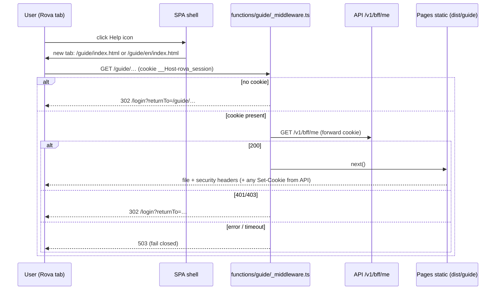

# PLAN — US-119: Official bilingual Rova User Guide

> Status: Approved for implementation · Date: 2026-10-07 · Story: [US-119](https://rova.qnsc.vn/item/US-119)
> Source content: BA site `Mini_Rally_pj/09_User_Guide` (v1.0, VI + EN, 13 chapters).

## Problem statement

Rova users have no in-product guide. The Help icon in the top bar (`apps/web/src/widgets/app-shell/app-shell.tsx:733`) is a raw `<button>` that only toasts "Help & documentation coming soon". The BA has produced an official bilingual (VI/EN) static guide; US-119 ships it inside Rova.

## Requirements

User story: As a Rova user, I want to open an official bilingual User Guide directly from Rova, so that I can understand the product structure and complete daily work without relying on external instructions.

Acceptance criteria (AC1 wording to be updated by the BA — see "Deviation"):

- **AC1 — Open the guide.** Given I am signed in, when I select the Help icon, the official User Guide opens in a new browser tab and my current Rova page remains open.
- **AC2 — Switch language.** Selecting Vietnamese/English shows the guide in that language; the corresponding page and local links load without error.
- **AC3 — Navigate.** Left menu and previous/next controls move to the selected chapter; the current chapter and section are highlighted.
- **AC4 — Official v1 content.** Header shows Version 1.0 (`Phiên bản 1.0` in VI); diagrams, screenshots, styles and chapter content display with no broken assets.

Decisions taken during requirements gathering:

| # | Question | Decision |
|---|---|---|
| 1 | Who may read the guide | **Signed-in users only** — gated by a path-scoped Cloudflare Pages Function. Any valid Rova session; no workspace-role check. |
| 2 | Where the source lives | **Copied into the monorepo** at `apps/web/public/guide/`. BA updates arrive as PRs. |
| 3 | Initial language | **Browser language** — `vi*` → Vietnamese, anything else → English. |
| 4 | Entry point | **Help icon opens the guide directly in a new tab** — no menu. |

### Deviation to record with the BA

AC1 as written says "Help → Guideline". Per decision 4 there is no menu; the BA should amend AC1 to "When I select the Help icon" before review so acceptance is not tested against a control that does not exist.

## Background (findings)

- **Hosting is Cloudflare Pages**, not S3 + CloudFront (the README is stale): `infra/modules/stack/main.tf` (`module "web"`, `pages-web`), `.github/workflows/web-deploy.yml` (wrangler from `apps/web`). Everything in `apps/web/public/` is copied to `dist/` and served as static files on the SPA origin.
- **Existing Function** `apps/web/functions/v1/[[path]].ts` is deliberately path-scoped (not a global `_middleware.ts`) so static assets stay on Cloudflare's fast path. The guide gate follows the same pattern: `functions/guide/_middleware.ts` runs for `/guide/*` only.
- **Session check**: the SPA restores its session with `GET /v1/bff/me` using the `__Host-rova_session` cookie (`src/shared/api/auth-bootstrap.ts`). Login sends a `returnTo` to `/v1/bff/login/{sso,start}` (`src/pages/login/login-page.tsx`); `returnTo` validation and the callback redirect live in `@quynhonsemiconductor/identity` (not in this repo — must be verified, Task 4).
- **Guide content is self-contained**: 13 VI pages + 13 EN pages (`en/`), `styles.css`, `guide.js`, 10 PNGs in `assets/`. No external URLs, no inline `<script>`/`<style>`/`style=`/`on*=` → a strict CSP is possible. All 10 image references resolve. `WRITING_BRIEF.md` is an internal authoring brief and **must not be published**.
- **Defect in `guide.js` that breaks AC2/AC3 on Pages**: Cloudflare Pages 308-redirects `/guide/x.html` → `/guide/x`. `guide.js` computes `currentPage = pathname.split('/').pop()` and compares it with `'x.html'`, so it `location.replace`s back to `x.html` → redirect loop; `linkTarget()` compares raw pathnames, so menu highlighting fails; the language switch builds `en/<page>` from the extensionless name. Invisible under `file://` and the Vite dev server.
- **Shared UI**: `IconButton` (`shared/ui/icon-button.tsx`) supports `asChild`, enforces `aria-label` and the 24×24 `TARGET_SQUARE` floor. On-dark styling precedent: `ActionMenu`'s `onDark` classes.
- **SPA i18n** is English-only (`shared/i18n/i18n.ts`); shell copy goes in `locales/en/nav.json`.

## Project rules this work must follow

From `CLAUDE.md`, `CONTRIBUTING.md`, `apps/web/FRONTEND_CONVENTIONS.md`:

- Feature-Sliced Design, imports only downward; slices consumed through `index.ts` barrels.
- Use shared primitives — no raw `<button>`; icon-only control = `IconButton` with `aria-label`; click target ≥ 24×24 via `TARGET_SQUARE`.
- Colours from tokens, no raw hex, no static-colour inline `style`; type sizes `text-ui-*`; no `dark:` variants; compose with `cn()`.
- All user-facing copy through `t()`.
- File size: soft 300 / hard 500 lines. `app-shell.tsx` is already oversized — new UI goes in its own file.
- Ratchet tests (`src/test/*.ratchet.test.ts`, FE consistency) may only move downward.
- `pnpm lint` is repo-scoped; run it, not path-scoped eslint. Before push: `pnpm typecheck`, `pnpm --filter rova-web exec tsc --noEmit`, `pnpm lint`, `pnpm test`, `pnpm --filter rova-web test`.
- Trunk-based: branch from `main`, merge each part before starting the next. Squash merge only; PR title is Conventional Commits with lowercase subject and required scope for `feat` (e.g. `feat(web): …`). release-please owns versions.
- `Web CI required` is the merge gate; a new CI job must be added to `ci-required.needs`.
- Security: network-exposed surfaces must state their access control; fail closed; no open redirects.

## Proposed solution

Serve the guide as static files at `/guide/` from the same Pages project as the SPA (same origin, so the session cookie is sent). A path-scoped Pages Function validates the session against `/v1/bff/me` before any guide file — HTML, CSS, JS or screenshot — is served, and adds strict security headers. The Help icon becomes a real link (`<a target="_blank" rel="noopener noreferrer">`) whose `href` is chosen from the browser language.

## Task breakdown

### Task 1: Pages Function gate for `/guide/*`

- **Objective**: no guide file is served without a valid Rova session.
- **Implementation**:
  - `apps/web/functions/_lib/guide-gate.ts` — pure, injectable (`fetchImpl`, `next`), same style as `_lib/proxy.ts`.
  - Order of checks:
    1. `API_ORIGIN` missing → 500 (mirrors `proxyToApi`).
    2. No `__Host-rova_session` cookie → 302 `/login?returnTo=<encoded pathname + search>`. `returnTo` is built only from `new URL(request.url)` and is always a same-origin path (no open redirect). No API call is made.
    3. `GET ${API_ORIGIN}/v1/bff/me`, built via `buildProxyRequest` so cookie and `x-forwarded-*` handling match the proxy.
    4. 200 → `next()`; copy every upstream `Set-Cookie` onto the response (in case `/bff/me` refreshes the session — preserve them individually, as `buildClientResponse` does).
    5. 401/403 → the login redirect.
    6. Any other status or exception → 503, `Cache-Control: no-store`, never the content (fail closed).
  - Success headers:
    `Content-Security-Policy: default-src 'self'; script-src 'self'; style-src 'self'; img-src 'self' data:; frame-ancestors 'none'; base-uri 'self'; form-action 'none'`,
    `Cache-Control: private, no-cache`, `X-Frame-Options: DENY`, `X-Content-Type-Options: nosniff`, `Referrer-Policy: same-origin`, `X-Robots-Tag: noindex, nofollow`.
  - `apps/web/functions/guide/_middleware.ts` → `onRequest = (ctx) => guardGuide(ctx.request, ctx.env.API_ORIGIN, ctx.next)`.
- **Tests** (`functions/_lib/guide-gate.spec.ts`; already in the vitest `include`): each branch; `returnTo` cannot be absolute/off-origin; no API call without a cookie; `Set-Cookie` pass-through (multiple cookies); headers present on success; API error/exception never calls `next()`. `pnpm --filter rova-web typecheck` covers `functions/tsconfig.json`.
- **Demo**: `pnpm build:web` then `wrangler pages dev apps/web/dist` with `API_ORIGIN` pointing at the local API — `/guide/x` redirects to `/login` when signed out, reaches Pages when signed in.

### Task 2: Import guide content into `apps/web/public/guide/` with an integrity test

- **Objective**: the BA's v1.0 site ships in the build, and its structure is guarded so a future BA edit cannot silently break AC2/AC4.
- **Implementation**:
  - Copy from `Mini_Rally_pj/09_User_Guide`: all `*.html`, `styles.css`, `guide.js`, `assets/`, `en/`. **Exclude `WRITING_BRIEF.md`.**
  - Add `apps/web/public/guide/**` to `.prettierignore` and the ESLint ignores so tooling does not rewrite/fail on BA-authored files.
  - Never put a README or any `.md` under `public/` — it would be published.
  - Lands in the same PR as Task 1 so the content is never public on develop.
- **Tests** (`apps/web/src/test/user-guide.integrity.test.ts`, reads files with `import.meta.dirname`):
  - only `.html/.css/.js/.png/.jpg/.svg/.webp` under `public/guide`;
  - every relative `href`/`src` (ignoring `#hash` and `?v=`) resolves to an existing file;
  - VI ↔ EN page parity by filename;
  - every page header contains `Phiên bản 1.0` (VI) / `Version 1.0` (EN);
  - no `http(s)://` or protocol-relative `//` in `src`/`href`;
  - no inline `<script>`/`<style>`/`style=`/`on*=` (keeps the strict CSP valid).
- **Demo**: `pnpm build:web` produces `dist/guide/`; the guide renders under `wrangler pages dev` once signed in.

### Task 3: Make `guide.js` work with Cloudflare's extensionless URLs

- **Objective**: AC2/AC3 work on Pages, where `/guide/01-lam-quen.html` is served as `/guide/01-lam-quen`.
- **Implementation**:
  - One `pageName(pathname)` helper: last path segment; `''` → `index.html`; no extension → append `.html`.
  - Use it for `currentPage`, the expected-page redirect check, and the language-switch URL.
  - `linkTarget()` compares normalised page names (and directory: VI root vs `en/`), not raw `pathname`s.
  - Bump the `?v=` cache-buster for `guide.js` in all 26 pages.
  - Notify the BA: the repo copy is now the source of truth and has diverged from `Mini_Rally_pj`.
- **Tests** (`apps/web/src/test/user-guide.script.test.ts`, jsdom with `runScripts: 'dangerously'` and a `url`): load a chapter's HTML + `guide.js` at `…/guide/01-lam-quen`, `…/guide/01-lam-quen.html`, `…/guide/en/05-lap-ke-hoach#tao-iteration`; assert no `location.replace` (no loop), correct `.nav-item` and submenu link get `active`, breadcrumb names the chapter, and the language switch targets `en/<page>.html#hash` (VI→EN) and `../<page>.html#hash` (EN→VI).
- **Demo**: under `wrangler pages dev`, chapters, left menu, prev/next and the language switch work with no loop and correct highlighting.

### Task 4: Verify (and fix if needed) the login → guide return path

- **Objective**: a signed-out user who opens a guide URL lands back on that guide page after SSO — not on the SPA's NotFound route.
- **Implementation**:
  - Read how `@quynhonsemiconductor/identity` validates `returnTo` and performs the post-callback redirect.
  - If it is a server-side redirect that allows `/guide/...` paths → no change; record the evidence in the PR description.
  - If the SPA navigates client-side after login → add a minimal branch: a `returnTo` starting with `/guide/` does `window.location.assign(returnTo)` (full page load, so Pages + the gate serve it) instead of a router navigation; keep the same-origin, path-only validation.
  - If the package refuses the path → raise a change in the shared package (it is shared with opshub); do not work around it here.
- **Tests**: unit test for any added branch (`/guide/...` → full load; absolute/external `returnTo` refused).
- **Demo**: in a private window open `/guide/en/03-backlog-cong-viec`, sign in, land on that page.

### Task 5: Help icon opens the User Guide in a new tab

- **Objective**: AC1 — clicking the Help icon opens the guide in a new tab; the current Rova page stays open.
- **Implementation**:
  - `apps/web/src/widgets/app-shell/model/guide-url.ts`: pure `guideUrlFor(languages: readonly string[])` → `/guide/index.html` when the FIRST language starts with `vi` (case-insensitive), otherwise `/guide/en/index.html`. Explicit `index.html` works in both Vite dev and Pages.
  - `apps/web/src/widgets/app-shell/help-link.tsx`: `<IconButton asChild aria-label={t('nav:help.openGuide')}>` wrapping `<a href={guideUrlFor(navigator.languages)} target="_blank" rel="noopener noreferrer">` with `HelpCircle`. A real link (not `window.open`) so middle-click, "open in new tab", keyboard Enter and screen readers work and popup blockers do not interfere. Reuse `ActionMenu`'s on-dark classes for the dark header — no new static-colour inline style, no raw `<button>`. No hover tooltip (`title`) — removed in review on 2026-10-07; the accessible name comes from `aria-label`.
  - `locales/en/nav.json`: `help.openGuide` = "Open User Guide (opens in a new tab)".
  - `app-shell.tsx`: replace the raw Help `<button>` and its "coming soon" toast with `<HelpLink />`; drop the `toast` import if now unused (raw-button ratchet count goes down).
- **Tests**:
  - `guide-url.test.ts`: `['vi']`, `['vi-VN']`, `['en-US']`, `[]`, `['fr','vi']` (→ EN).
  - `help-link.test.tsx`: accessible name; `href` for a mocked `navigator.languages`; `target="_blank"`; `rel` contains `noopener` and `noreferrer`.
  - `app-shell.test.tsx`: source assertions — no "coming soon" toast; `HelpLink` is rendered.
  - All ratchets green.
- **Demo**: on develop, clicking the Help icon opens the guide in a new tab in the browser's language; the Backlog tab is unchanged.

### Task 6: End-to-end journey and project notes

- **Objective**: AC1–AC4 covered by one Playwright surface journey; the non-obvious rules recorded where this repo keeps them.
- **Implementation**:
  - `apps/web/src/test/e2e/user-guide.e2e.ts` (one journey, per the repo's per-surface rule): `loginAndSelectProject` → `/backlog` → click Help icon → `context.waitForEvent('page')` → assert `Version 1.0`/`Phiên bản 1.0` header, every `` has `naturalWidth > 0`, stylesheet applied (AC4) → switch language, assert the counterpart page loads (AC2) → click a chapter in the left menu and the next control, assert `active` highlight (AC3) → assert the original tab is still on `/backlog` (AC1).
  - The Vite dev server does not run Pages Functions, so the gate and extensionless URLs are covered by Task 1 and Task 3 unit tests, not Playwright.
  - Add a short `CLAUDE.md` section "The User Guide is static, gated, and extensionless on Pages": why a path-scoped middleware; cost (one `/bff/me` call per guide request, ~15 per page view); the `pageName` rule; BA edits arrive as PRs to `apps/web/public/guide` guarded by the integrity test; never place `.md` under `public/`.
- **Demo**: `pnpm --filter rova-web test:e2e user-guide` passes; `Web CI required` green.

### Task 7: Acceptance on develop

- **Objective**: BA sign-off of US-119 on develop before the prod tag.
- **Implementation**: merge to `main` (develop deploys automatically). Verify signed-out redirect and post-login return; VI/EN default per browser locale; response headers in DevTools; `noindex`; prev/next and highlighting on extensionless URLs. Promote to prod with the normal semver tag.
- **Demo**: BA walks AC1–AC4 on `rova-dev`.

## Delivery (stacked, three PRs — the CLAUDE.md "one PR per story or per layer" rule)

PR 1 targets `main`; PR 2 and PR 3 are stacked on it (three deep, the CONTRIBUTING maximum) and are retargeted to `main` as each parent merges, restacked with `git rebase --update-refs --onto origin/main <old-parent-tip> <top-branch>`.

1. `feat(web): gate and publish the bilingual user guide` — Tasks 1–3 (gate lands with the content). Branch `feat/us-119-user-guide`.
2. `feat(web): open the user guide from the help icon` — Tasks 4–5. Branch `feat/us-119-help-link`.
3. `test(web): user guide journey and notes` — Task 6. Branch `test/us-119-user-guide-journey`.

## Out of scope / notes

- README still says S3 + CloudFront — fix in a separate `docs:` PR.
- Locally, Vite dev serves `/guide/` ungated (dev only).
- Pages Function invocations rise ~15 per guide page view; check against the Workers quota.
- BA to amend AC1 wording (see "Deviation").
